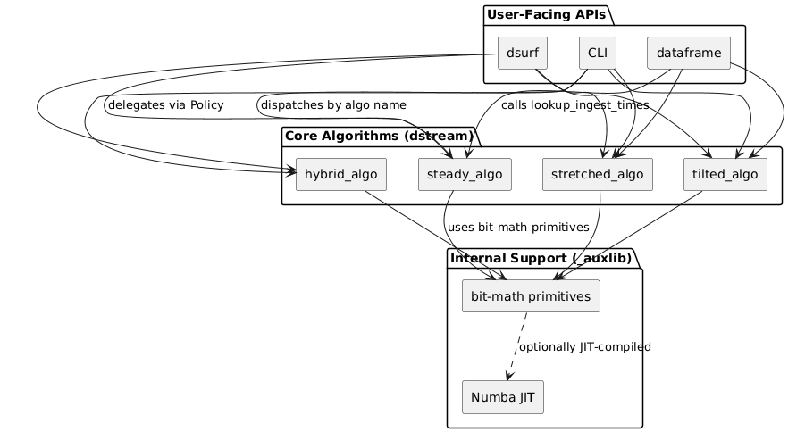
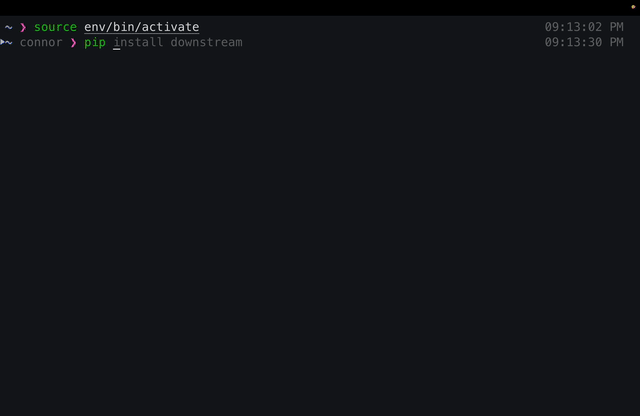

[](https://github.com/mmore500/downstream)
[](https://pypi.python.org/pypi/downstream)
[](https://crates.io/crates/downstream)
[](https://zenodo.org/doi/10.5281/zenodo.10866541)
[](https://opensource.org/licenses/MIT)
[](https://github.com/mmore500/downstream/actions/workflows/ci.yaml)
[](https://github.com/mmore500/downstream/actions/workflows/python-ci.yaml?query=branch:python)
[](https://github.com/mmore500/downstream/actions/workflows/rust-ci.yaml?query=branch:csl)
[](https://github.com/mmore500/downstream/actions/workflows/cpp-ci.yaml?query=branch:cpp)
[](https://github.com/mmore500/downstream/actions/workflows/zig-ci.yaml?query=branch:zig)

**Downstream** provides efficient, constant-space implementations of stream curation algorithms across Python, C++, Rust, Zig, and CSL.

Ring buffers keep only the most recent *n* items, discarding history. Downstream does better: it curates a **representative sample of the entire stream** using O(1) memory and O(1) per-item ingestion — regardless of how long the stream runs.

- **Documentation:** https://mmore500.github.io/downstream
- **PyPI:** `pip install downstream`
- **Crates.io:** `cargo add downstream`

---

## Table of Contents

- [Overview](#overview)
- [Features](#features)
- [How It Works](#how-it-works)
- [Installation](#installation)
- [Quickstart](#quickstart)
- [Contributing](#contributing)
- [FAQ](#faq)
- [Citing](#citing)
- [Credits](#credits)

---

## Overview

Data streams routinely exceed available memory. The standard solution — a ring buffer — throws away everything except the most recent *n* items. This is fine for last-*n* monitoring, but loses all historical context.

**Downstream** solves this with a different kind of fixed-capacity buffer: one that intelligently decides *which* item to overwrite at each step, maintaining a temporally representative history across the entire stream. All algorithms share a single O(1) interface — no sorting, no scanning the buffer, no dynamic allocation.

Downstream is used in:
- **Digital evolution and phylogenetics** — tracking lineage histories in memory-constrained simulators ([hstrat](https://github.com/mmore500/hstrat))
- **Wafer-scale computing** — evolution simulations on Cerebras hardware where per-core memory is tiny
- **Real-time monitoring** — balancing recency vs. historical coverage in streaming pipelines

---

## Features

| Feature | Description |
|---------|-------------|
| **Three core algorithms** | `steady`, `stretched`, and `tilted` each curate a different temporal distribution |
| **Hybrid variants** | Partition the buffer between algorithms for mixed coverage |
| **Multi-language** | Python, C++, Rust, Zig, and Cerebras Software Language (CSL) |
| **Constant space, O(1) ingestion** | No allocations; every item decision is pure arithmetic |
| **JIT acceleration** | Optional Numba compilation for high-throughput Python workloads |
| **Container and Buffer APIs** | High-level object-oriented interface or low-level user-managed storage |
| **DataFrame postprocessing** | NumPy-vectorized batch lookups on serialized buffers |
| **CLI included** | `python3 -m downstream --help` |

---

The retention policy — which slot gets overwritten next — is fully determined by the chosen algorithm (steady, stretched, tilted, or a hybrid) and isn't separately configurable. Concepts like "bins" or "segments," shown in some of the visualizations below, are internal implementation details of how a given algorithm organizes the buffer; they aren't a parameter you set yourself.

## How It Works

A traditional ring buffer overwrites the oldest slot, keeping only the tail of the stream:


Downstream tracks which item to overwrite at each step so that retained items stay spread across the entire stream history. The animation below shows this step by step for a larger, 15-slot buffer — each new item either claims a slot or is discarded, and the buffer always maintains representative coverage. Note that, unlike the diagram above, time in this animation runs top to bottom, and slots are grouped into labeled "bins" and "segments" — an internal detail of how the buffer is organized that's explained further below:


In the animation above, labels like r0 and h0 are shorthand from the underlying algorithm: r followed by a number identifies which retained value is shown, and h followed by a number indicates that value's position within its bin. These labels reflect internal bookkeeping rather than something you need to track yourself — see the Architecture section below for how this connects to the public API.

Downstream's general curation strategy — illustrated here for a single S=4 buffer — keeps items spread across the full history rather than just the most recent ones, unlike the ring buffer shown earlier:


Each column shows site assignments at a different point in the stream. Compare to the ring buffer above: the lookup formula here is more involved, but older items are retained instead of always being discarded.

### Choosing an Algorithm

| Algorithm | Retention density | Best for |
|-----------|-------------------|----------|
| **Steady** | Uniform across entire history | Trend analysis; every era matters equally |
| **Stretched** | Denser at older data | Emphasizing initial conditions or ancient history |
| **Tilted** | Denser at recent data | Real-time monitoring; recency-weighted analysis |

Hybrid variants (e.g., `hybrid_0_steady_1_tilted_2_algo`) split the buffer between two algorithms for mixed coverage. See the [algorithm selection guide](https://mmore500.github.io/downstream/algorithm/) for more detail.

### Architecture

The library is organized into three layers, shown below: user-facing APIs at the top, core algorithms in the middle, and shared primitives at the bottom.



Reading the diagram top to bottom: user-facing APIs (dsurf, dataframe, CLI) all delegate to the core algorithm implementations in dstream. The algorithms in turn share a common set of bit-math primitives in _auxlib, which can be optionally JIT-compiled via Numba. Each arrow represents a function call from the layer above into the layer below — there are no calls in the reverse direction.

---

## Installation

### Python (pip)

```bash
pip install downstream
```

With optional JIT acceleration via Numba:

```bash
pip install "downstream[jit]==1.22.0"
```

### Container (Docker / Singularity)

```bash
singularity exec docker://ghcr.io/mmore500/downstream python3 -m downstream --help
```

### Other Languages

Downstream is also available for [C++](https://mmore500.github.io/downstream/cpp/), [Rust](https://crates.io/crates/downstream), [Zig](https://mmore500.github.io/downstream/zig/), and [CSL](https://mmore500.github.io/downstream/csl/).

---

## Quickstart



```python
from downstream.dsurf import Surface
from downstream.dstream import steady_algo

surface = Surface(steady_algo, 8)  # buffer size must be a power of 2

for T in range(100):
    surface.ingest(T)

# retrieve stored values paired with their original stream indices
print([*surface.enumerate()])
```

For full API documentation, see the [Python reference](https://mmore500.github.io/downstream/python/).

---

## Contributing

Contributions are welcome! See the [contributing guide](docs/docs/contributing.md) for details.

- **Bug reports / feature requests:** [GitHub Issues](https://github.com/mmore500/downstream/issues)
- **New language ports:** Each language lives on its own branch (`python`, `cpp`, `rust`, `zig`, `csl`)

All contributions are governed by our [Code of Conduct](https://www.contributor-covenant.org/version/2/0/code_of_conduct.html).

---

## FAQ

**What buffer sizes are valid?**
`S` must be a power of 2 (e.g., 8, 16, 32, 64). This is a hard requirement of the underlying algorithms.

**Why does ingestion sometimes return `None` (or a site equal to `S`)?**
This means the current item should be discarded — the algorithm determined it isn't needed to maintain the desired temporal distribution. Discards are expected and normal, especially early in the stream.

**What is the maximum stream length?**
`steady_algo` has no practical ingest limit. `stretched_algo` and `tilted_algo` support up to `2**S - 2` items. Use the `xtc` variants (`stretchedxtc_algo`, `tiltedxtc_algo`) for an extended domain.

**Does downstream require NumPy?**
The Buffer API has no NumPy dependency. The Container API (`dsurf.Surface`) and DataFrame API do. The `[jit]` extra adds Numba for accelerated batched operations.

**Can I use downstream in a language other than Python?**
Yes — C++, Rust, Zig, and CSL are all supported. See the [documentation](https://mmore500.github.io/downstream) for per-language instructions.

---

## Citing

If downstream contributes to a scientific publication, please cite it as:

> Yang C., Wagner J., Dolson E., Zaman L., & Moreno M. A. (2025). Downstream: efficient cross-platform algorithms for fixed-capacity stream downsampling. *arXiv preprint arXiv:2506.12975.* https://doi.org/10.48550/arXiv.2506.12975

```bibtex
@misc{yang2025downstream,
      doi={10.48550/arXiv.2506.12975},
      url={https://arxiv.org/abs/2506.12975},
      title={Downstream: efficient cross-platform algorithms for fixed-capacity stream downsampling},
      author={Connor Yang and Joey Wagner and Emily Dolson and Luis Zaman and Matthew Andres Moreno},
      year={2025},
      eprint={2506.12975},
      archivePrefix={arXiv},
      primaryClass={cs.DS},
}
```

If you find downstream useful, please [leave a star on GitHub!](https://github.com/mmore500/downstream/stargazers)

---

## Credits

**Authors:** Connor Yang, Joey Wagner, Emily Dolson, Luis Zaman, Matthew Andres Moreno

This package was created with [Cookiecutter](https://github.com/audreyr/cookiecutter) and the [mmore500/cookiecutter-dishtiny-project](https://github.com/mmore500/cookiecutter-dishtiny-project) project template.
