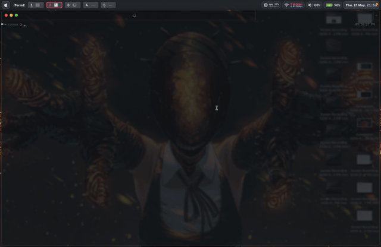
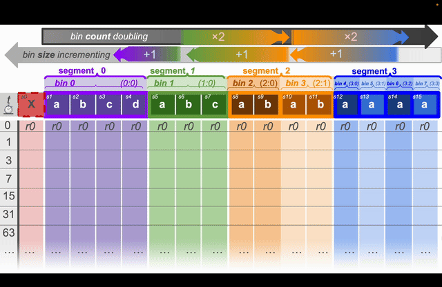

[](https://github.com/mmore500/downstream)
[](https://pypi.python.org/pypi/downstream)
[](https://crates.io/crates/downstream)
[](https://zenodo.org/doi/10.5281/zenodo.10866541)
[](https://opensource.org/licenses/MIT)
[](https://github.com/mmore500/downstream/actions/workflows/ci.yaml)
[](https://github.com/mmore500/downstream/actions/workflows/python-ci.yaml?query=branch:python)
[](https://github.com/mmore500/downstream/actions/workflows/rust-ci.yaml?query=branch:csl)
[](https://github.com/mmore500/downstream/actions/workflows/cpp-ci.yaml?query=branch:cpp)
[](https://github.com/mmore500/downstream/actions/workflows/zig-ci.yaml?query=branch:zig)

**Downstream** provides efficient, constant-space implementations of stream curation algorithms across Python, C++, Rust, Zig, and CSL.

Ring buffers keep only the most recent *n* items, discarding history. Downstream does better: it curates a **representative sample of the entire stream** using O(1) memory and O(1) per-item ingestion — regardless of how long the stream runs.

- **Documentation:** https://mmore500.github.io/downstream
- **PyPI:** `pip install downstream`
- **Crates.io:** `cargo add downstream`

---

## Table of Contents

- [Overview](#overview)
- [Features](#features)
- [How It Works](#how-it-works)
- [Installation](#installation)
- [Quickstart](#quickstart)
- [Usage Examples](#usage-examples)
- [Contributing](#contributing)
- [FAQ](#faq)
- [Citing](#citing)
- [Credits](#credits)

---

## Overview

Data streams routinely exceed available memory. The standard solution — a ring buffer — throws away everything except the most recent *n* items. This is fine for last-*n* monitoring, but loses all historical context.

**Downstream** solves this with a different kind of fixed-capacity buffer: one that intelligently decides *which* item to overwrite at each step, maintaining a temporally representative history across the entire stream. All three core algorithms share a single O(1) interface — no sorting, no scanning the buffer, no dynamic allocation.

Downstream is used in:
- **Digital evolution and phylogenetics** — tracking lineage histories in memory-constrained simulators ([hstrat](https://github.com/mmore500/hstrat))
- **Wafer-scale computing** — evolution simulations on Cerebras hardware where per-core memory is tiny
- **Real-time monitoring** — balancing recency vs. historical coverage in streaming pipelines

---

## Features

| Feature | Description |
|---------|-------------|
| **Three core algorithms** | `steady`, `stretched`, and `tilted` each curate a different temporal distribution |
| **Hybrid variants** | Partition the buffer between algorithms for mixed coverage |
| **Multi-language** | Python, C++, Rust, Zig, and Cerebras Software Language (CSL) |
| **Constant space, O(1) ingestion** | No allocations; every item decision is pure arithmetic |
| **JIT acceleration** | Optional Numba compilation for high-throughput Python workloads |
| **Container and Buffer APIs** | High-level object-oriented interface or low-level user-managed storage |
| **DataFrame postprocessing** | NumPy-vectorized batch lookups on serialized buffers |
| **CLI included** | `python3 -m downstream --help` |

---

## How It Works

A traditional ring buffer overwrites the oldest slot, keeping only the tail of the stream:


Downstream tracks *which item to overwrite* at each step so that retained items stay spread across the entire stream history:


Each column is a snapshot of the buffer at a given stream position. Colors indicate the original ingest time of the stored value — warm colors are older, cool colors are newer.

### Choosing an Algorithm

| Algorithm | Retention density | Best for |
|-----------|-------------------|----------|
| **Steady** | Uniform across entire history | Trend analysis; every era matters equally |
| **Stretched** | Denser at older data | Emphasizing initial conditions or ancient history |
| **Tilted** | Denser at recent data | Real-time monitoring; recency-weighted analysis |

Hybrid variants (e.g., `hybrid_0_steady_1_tilted_2_algo`) split the buffer between two algorithms for mixed coverage. See the [algorithm selection guide](https://mmore500.github.io/downstream/algorithm/) for more detail.

---

## Installation

### Python (pip)

```bash
pip install downstream
```

With optional JIT acceleration via Numba:

```bash
pip install "downstream[jit]==1.22.0"
```

### Container (Docker / Singularity)

```bash
singularity exec docker://ghcr.io/mmore500/downstream python3 -m downstream --help
```

### Other Languages

Downstream is also available for [C++](https://mmore500.github.io/downstream/cpp/), [Rust](https://crates.io/crates/downstream), [Zig](https://mmore500.github.io/downstream/zig/), and [CSL](https://mmore500.github.io/downstream/csl/).

---

## Quickstart

<!-- TODO: Add GIF — terminal recording of `pip install downstream` followed by running the Container API snippet below -->


### Container API (Python — recommended)

Use `Surface` for a high-level, object-oriented interface. It manages storage internally and exposes an iterable view of current buffer contents.

```python
from downstream.dsurf import Surface
from downstream.dstream import steady_algo

S = 8  # Buffer size; must be a power of 2
surface = Surface(steady_algo, S)

for T in range(100):
    site = surface.ingest_one(T)  # Returns None if this item is discarded

# Retrieve stored values paired with their original stream indices
print([*surface.lookup_zip_items()])
# [(0, 0), (64, 64), (32, 32), (16, 16), (8, 8), (72, 72), (88, 88), (96, 96)]
```

### Buffer API (low-level / cross-language pattern)

For other languages or performance-sensitive code, manage storage yourself and call `assign_storage_site` directly.

```python
from downstream import dstream

S = 8  # Buffer size; must be a power of 2
buffer = [None] * S

for T in range(20):
    site = dstream.steady_algo.assign_storage_site(S, T)
    if site != S:           # site == S means discard
        buffer[site] = T    # store data at the assigned slot
        print(f"T={T} stored at site {site}")
```

A site equal to `S` (or `None` in the Container API) indicates the item should be discarded — this is normal and expected behavior.

---

## Usage Examples

### Switching Algorithms

All algorithms share identical APIs — swap one in for another with a single import change:

```python
from downstream.dsurf import Surface
from downstream.dstream import tilted_algo, stretched_algo, steady_algo

surface_recent   = Surface(tilted_algo,    S=16)  # emphasis on recent
surface_ancient  = Surface(stretched_algo, S=16)  # emphasis on older data
surface_balanced = Surface(steady_algo,    S=16)  # uniform distribution
```



### Batched Ingestion for High-Throughput Workloads

```python
import numpy as np
from downstream import dstream

S = 64
T_batch = np.arange(10_000)
sites = dstream.steady_algo.assign_storage_site_batched(S, T_batch)
# sites is a NumPy array; sites[i] == S means discard item i
```

### Checking Algorithm Capacity

Stretched and tilted algorithms support at most `2**S - 2` items. Use the capacity helpers to guard against overflow:

```python
from downstream.dstream import tilted_algo

S = 8
print(tilted_algo.get_ingest_capacity(S))        # 254
print(tilted_algo.has_ingest_capacity(S, T=253)) # True
print(tilted_algo.has_ingest_capacity(S, T=255)) # False
```

`steady_algo` has no practical capacity limit.

### DataFrame Postprocessing

Serialize your buffer to CSV or Parquet after a run, then recover stored values and their original stream indices in bulk:

`input.csv`:
```csv
dstream_algo,downstream_version,data_hex,dstream_storage_bitoffset,dstream_storage_bitwidth,dstream_T_bitoffset,dstream_T_bitwidth,dstream_S
dstream.steady_algo,1.0.1,080001030702050406,8,64,0,8,8
```

```bash
ls input.csv | python3 -m downstream.dataframe.explode_lookup_packed_uint output.csv
```

`output.csv`:
```csv
dstream_data_id,dstream_T,dstream_value_bitwidth,dstream_value,dstream_Tbar
0,8,8,0,0
0,8,8,1,1
0,8,8,3,3
0,8,8,7,7
...
```

### Command-Line Interface

```bash
python3 -m downstream --help
```

---

## Contributing

Contributions are welcome! Every little bit helps.

- **Bug reports:** [GitHub Issues](https://github.com/mmore500/downstream/issues) — include your OS, Python version, and steps to reproduce
- **Feature requests:** Open an issue tagged `enhancement`
- **New language ports:** Each language lives on its own branch (`python`, `cpp`, `rust`, `zig`, `csl`). Follow the existing `dstream/` structure and implement the standard CLI for cross-language test compatibility. See [contributing guide](docs/docs/contributing.md) for details.
- **Documentation:** Docstring improvements, tutorials, and blog posts are all welcome

All contributions are governed by our [Code of Conduct](https://www.contributor-covenant.org/version/2/0/code_of_conduct.html).

---

## FAQ

**What buffer sizes are valid?**
`S` must be a power of 2 (e.g., 8, 16, 32, 64, ...). This is a hard requirement of the underlying algorithms.

**Why does `assign_storage_site` return `S` (or `None`)?**
This signals that the current item should be discarded. The algorithm determined it is not needed to maintain the desired temporal distribution. Discards are expected and normal — especially early in the stream.

**What is the maximum stream length?**
`steady_algo` has no practical ingest limit. `stretched_algo` and `tilted_algo` support up to `2**S - 2` items. Use `*_algo.get_ingest_capacity(S)` to query the limit, or the `xtc` variants (`stretchedxtc_algo`, `tiltedxtc_algo`) for an extended domain.

**Does downstream require NumPy?**
The Buffer API (`dstream.*.assign_storage_site`) has no NumPy dependency. The Container API (`dsurf.Surface`) and DataFrame API do require NumPy. The `[jit]` extra adds Numba for accelerated batched operations.

**How do I serialize a buffer for later analysis?**
Serialize using `surface.to_hex()`, write the hex value to CSV/Parquet alongside metadata columns, then run `downstream.dataframe.explode_lookup_packed_uint` to reconstruct ingest times in batch. See the [DataFrame postprocessing](#dataframe-postprocessing) example above.

**Can I use downstream in a language other than Python?**
Yes — C++, Rust, Zig, and CSL are all supported on dedicated branches. See the [documentation](https://mmore500.github.io/downstream) for per-language install and usage instructions.

---

## Citing

If downstream contributes to a scientific publication, please cite it as:

> Yang C., Wagner J., Dolson E., Zaman L., & Moreno M. A. (2025). Downstream: efficient cross-platform algorithms for fixed-capacity stream downsampling. *arXiv preprint arXiv:2506.12975.* https://doi.org/10.48550/arXiv.2506.12975

```bibtex
@misc{yang2025downstream,
      doi={10.48550/arXiv.2506.12975},
      url={https://arxiv.org/abs/2506.12975},
      title={Downstream: efficient cross-platform algorithms for fixed-capacity stream downsampling},
      author={Connor Yang and Joey Wagner and Emily Dolson and Luis Zaman and Matthew Andres Moreno},
      year={2025},
      eprint={2506.12975},
      archivePrefix={arXiv},
      primaryClass={cs.DS},
}
```

If you find downstream useful, please [leave a star on GitHub!](https://github.com/mmore500/downstream/stargazers)

---

## Credits

**Authors:** Connor Yang, Joey Wagner, Emily Dolson, Luis Zaman, Matthew Andres Moreno

This package was created with [Cookiecutter](https://github.com/audreyr/cookiecutter) and the [mmore500/cookiecutter-dishtiny-project](https://github.com/mmore500/cookiecutter-dishtiny-project) project template.
